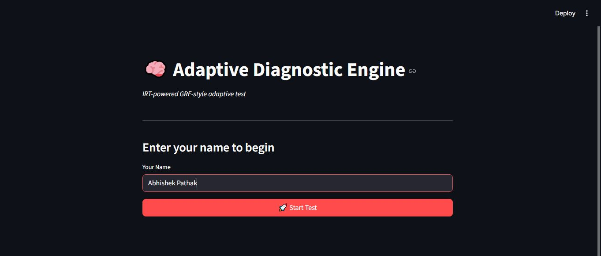
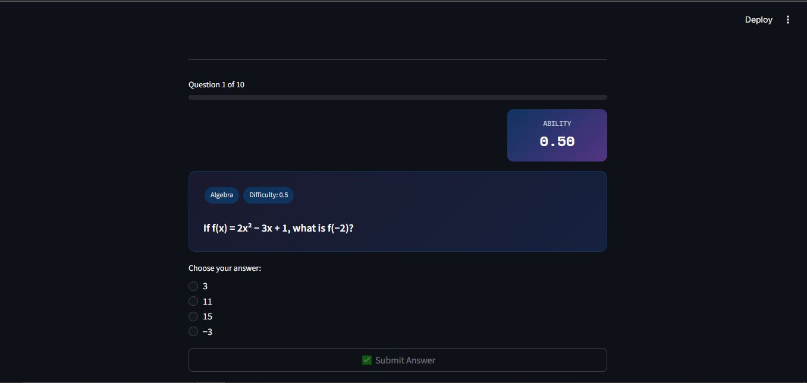
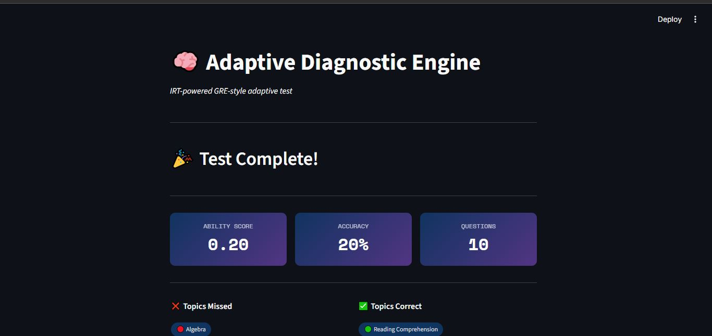
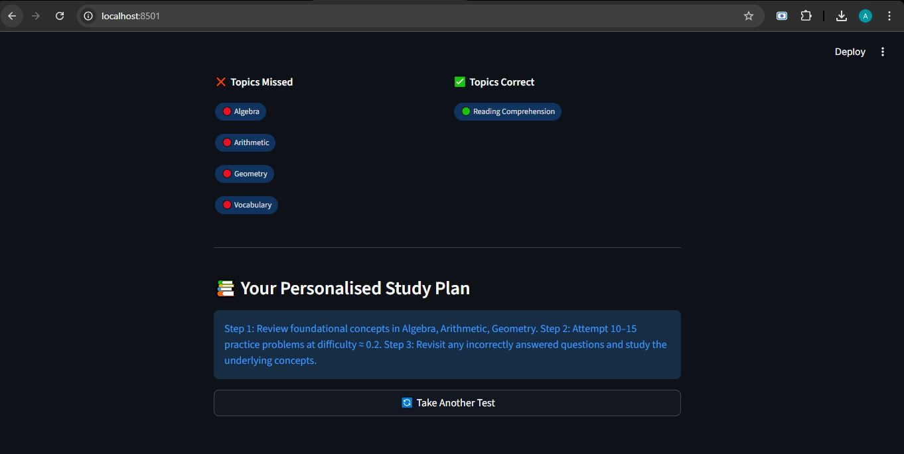

# 🧠 AI-Driven Adaptive Diagnostic Engine

A production-ready **1-Dimension Adaptive Testing** prototype built with FastAPI, MongoDB, and the Anthropic Claude API. The system dynamically selects questions based on each student's evolving ability estimate, then generates a personalised study plan when the test concludes.

---
## 🎥 Demo Video

[](https://youtu.be/z3cFEFnqozI)


## 📸 Screenshots

### 1. Start Test


### 2. Question Screen


### 3. Answer Feedback


### 4. Final Results & Study Plan



## Table of Contents

1. [Project Overview](#project-overview)
2. [Adaptive Algorithm Explained](#adaptive-algorithm-explained)
3. [Project Structure](#project-structure)
4. [Setup Instructions](#setup-instructions)
5. [Running the Server](#running-the-server)
6. [API Documentation](#api-documentation)
7. [Example curl Requests](#example-curl-requests)
8. [AI Log](#ai-log)

---

## Project Overview

| Layer | Technology |
|-------|-----------|
| Backend API | Python 3.11 + FastAPI |
| Database | MongoDB (Motor async driver) |
| AI Integration | Anthropic Claude (claude-3-5-haiku) |
| Adaptive Algorithm | 1-PL Item Response Theory (Rasch model) |

**Key Features**

- 20 GRE-style questions across 5 topics (Algebra, Arithmetic, Geometry, Vocabulary, Reading Comprehension)
- IRT-inspired ability estimation updated after every response
- Maximum-information next-question selection
- LLM-generated 3-step personalised study plan on test completion
- Clean, modular architecture with full type hints and docstrings

---

## Adaptive Algorithm Explained

The engine uses a **1-Parameter Logistic (Rasch) IRT model**.

### 1. Initialisation
Every new session starts at a baseline ability score of **0.5** (mid-range on the 0.1–1.0 scale).

### 2. Ability Update
After each answer the ability score is revised:

```
P(correct) = 1 / (1 + exp(-(ability - difficulty)))
ability_new = ability_old + η × (result − P(correct))
```

Where:
- `result` = 1 if correct, 0 if incorrect
- `η` (learning rate) = 0.1
- Score is **clamped** to `[0.1, 1.0]`

**Intuition:** If the student answers correctly a question that was *easy* for them (high P), the ability score barely changes. If they correctly answer a *hard* question (low P), the score jumps more — reflecting a genuine surprise.

### 3. Next-Question Selection
The engine picks the unanswered question whose `difficulty` is **closest** to the current `ability_score`. This maximises the *Fisher information* extracted per question, keeping the test well-calibrated regardless of the student's level.

### 4. Test Completion
After **10 questions** the session is marked complete. Performance data (topics missed, ability score, accuracy) is sent to the Anthropic API to generate a tailored 3-step study plan.

---

## Project Structure

```
adaptive-diagnostic-engine/
│
├── app/
│   ├── main.py            ← FastAPI app factory, lifespan hooks
│   ├── config.py          ← Pydantic Settings (all env vars)
│   ├── database.py        ← Motor client management + collection helpers
│   │
│   ├── models/
│   │   ├── question_model.py   ← Question DB + API response schemas
│   │   └── session_model.py    ← Session DB + request/response schemas
│   │
│   ├── services/
│   │   ├── adaptive_engine.py  ← IRT ability update + question selection
│   │   ├── question_service.py ← MongoDB CRUD for questions
│   │   └── ai_insights.py      ← Anthropic API study-plan generation
│   │
│   ├── routes/
│   │   └── test_routes.py      ← All HTTP endpoint handlers
│   │
│   └── utils/
│       └── helpers.py          ← Shared pure utility functions
│
├── seed/
│   └── seed_questions.py  ← One-time DB population script (20 questions)
│
├── requirements.txt
├── .env.example
└── README.md
```

---

## Setup Instructions

### 1. Clone the Repository
```bash
git clone https://github.com/<your-username>/adaptive-diagnostic-engine.git
cd adaptive-diagnostic-engine
```

### 2. Create a Virtual Environment
```bash
python -m venv venv
source venv/bin/activate        # Linux / macOS
# venv\Scripts\activate         # Windows
```

### 3. Install Dependencies
```bash
pip install -r requirements.txt
```

### 4. Configure Environment Variables
```bash
cp .env.example .env
```

Edit `.env` and fill in your values:

```env
MONGODB_URI=mongodb+srv://<user>:<pass>@cluster.mongodb.net/?retryWrites=true&w=majority
MONGODB_DB_NAME=adaptive_engine
ANTHROPIC_API_KEY=sk-ant-...
MAX_QUESTIONS_PER_SESSION=10
LEARNING_RATE=0.1
```

### 5. Seed the Database
```bash
python seed/seed_questions.py
```

You should see 20 `INSERT` lines confirming the questions were loaded.

---

## Running the Server

```bash
uvicorn app.main:app --reload --port 8000
```

Interactive API docs are available at: **http://localhost:8000/docs**

---

## API Documentation

### `POST /api/v1/start-test`
Start a new adaptive test session.

| Field | Type | Description |
|-------|------|-------------|
| `user_id` | string | Any identifier for the student |

**Response:**
```json
{
  "session_id": "...",
  "ability_score": 0.5,
  "question": { "id": "...", "question_text": "...", "options": [...], "difficulty": 0.3, "topic": "...", "tags": [...] },
  "questions_answered": 0,
  "total_questions": 10
}
```

---

### `GET /api/v1/next-question/{session_id}`
Fetch the next adaptive question for an active session.

**Response:** Same shape as start-test response.

---

### `POST /api/v1/submit-answer`
Submit the student's answer and receive feedback + next question.

| Field | Type | Description |
|-------|------|-------------|
| `session_id` | string | Active session id |
| `question_id` | string | Question id being answered |
| `selected_answer` | string | The chosen option string |

**Response:**
```json
{
  "session_id": "...",
  "is_correct": true,
  "correct_answer": "30",
  "ability_score": 0.534,
  "questions_answered": 1,
  "total_questions": 10,
  "is_complete": false,
  "next_question": { ... }
}
```

---

### `GET /api/v1/results/{session_id}`
Retrieve final results and the AI-generated study plan.

**Response:**
```json
{
  "session_id": "...",
  "user_id": "alice",
  "final_ability_score": 0.62,
  "questions_answered": 10,
  "accuracy": 0.7,
  "topics_missed": ["Algebra", "Vocabulary"],
  "topics_correct": ["Arithmetic"],
  "study_plan": "Step 1: Review Algebra fundamentals...\nStep 2: ...\nStep 3: ..."
}
```

---

## Example curl Requests

```bash
# 1 — Start a test
curl -X POST http://localhost:8000/api/v1/start-test \
  -H "Content-Type: application/json" \
  -d '{"user_id": "alice"}'

# 2 — Submit an answer (replace ids from previous response)
curl -X POST http://localhost:8000/api/v1/submit-answer \
  -H "Content-Type: application/json" \
  -d '{
    "session_id": "<session_id>",
    "question_id": "<question_id>",
    "selected_answer": "30"
  }'

# 3 — Get next question manually
curl http://localhost:8000/api/v1/next-question/<session_id>

# 4 — Fetch final results after 10 answers
curl http://localhost:8000/api/v1/results/<session_id>

# 5 — Health check
curl http://localhost:8000/health
```

---

## AI Log

### How AI tools were used

**Claude (Anthropic)** was used throughout development to accelerate the following tasks:

1. **Algorithm scaffolding** – The IRT update formula and clamping logic were prototyped by prompting Claude with the mathematical definition and asking it to produce a Python implementation with type hints and edge-case comments. Output was verified against the Rasch model literature.

2. **Boilerplate generation** – FastAPI route handlers and Pydantic model schemas follow repetitive patterns; Claude generated first drafts that were then refined for the specific domain (session management, answer grading).

3. **Question authoring** – All 20 GRE-style questions were written with Claude's assistance: topic, difficulty calibration, and plausible distractors were iterated through conversation until the difficulty spread felt realistic.

4. **Prompt engineering** – The study-plan prompt in `ai_insights.py` went through three revisions informed by Claude's own suggestions for how to get concise, actionable output from the API.

### What AI couldn't solve (required human judgment)

- **MongoDB async driver choice** – Selecting Motor over PyMongo for production-grade async FastAPI required architectural knowledge that AI suggestions alone didn't settle definitively.
- **Clamping bounds** – Choosing `[0.1, 1.0]` instead of `[0.0, 1.0]` to prevent degenerate probability outputs (P = 0 or P = 1) required domain reasoning about IRT behaviour.
- **Idempotent seeding** – The decision to check `question_text` uniqueness before insertion to support repeated seed runs was a pragmatic engineering call not surfaced by AI tooling.
